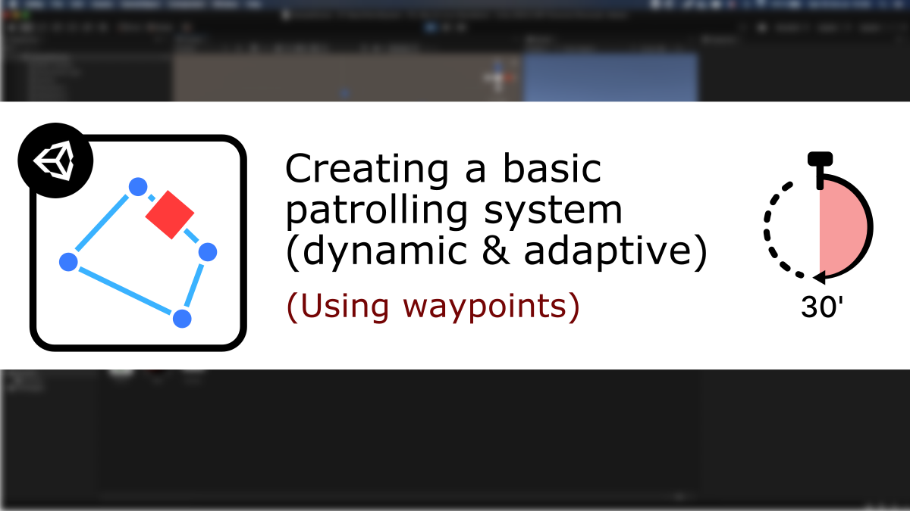
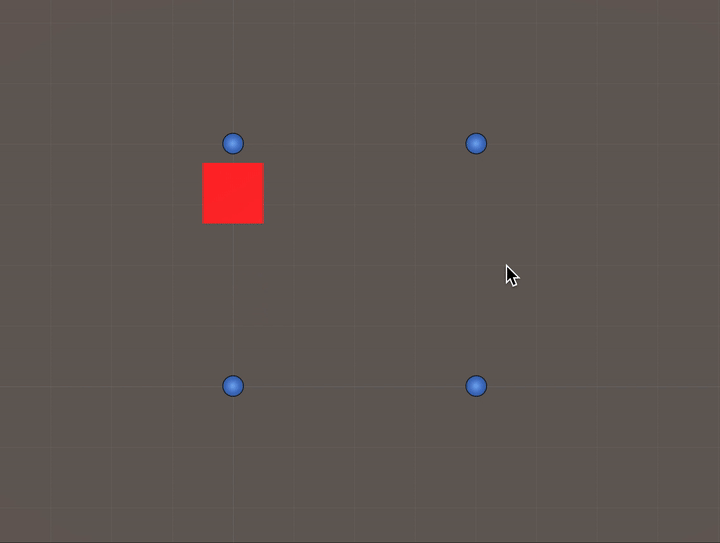

# [Unity/C#] A basic patrol system (using waypoints)

**Mina Pêcheux - October 2021**

How can we create a basic patrolling system for character unit 3D movement that is waypoints-based? Let's discover more in this video/text tutorial: "How to make a basic patrolling system in less than 30 minutes" :)

You can read it in text format [on Medium](https://mina-pecheux.medium.com/how-to-make-a-basic-patrolling-system-in-unity-c-3bec0cf63478), or watch it [on Youtube](https://www.youtube.com/watch?v=oD7akZVgT4I).

In this less than 30 minutes-tutorial, I'm discussing why adding an idle behavior to your units can be interesting, how to get a unit moving between waypoints and how to have it look at its target continuously or wait for a while at each waypoint!

This Github repo contains the script that is coded in the tutorial, plus an alternate version of the `Patrol` class, `PatrolCoroutines`, that shows how to implement the same basic patrolling system using **Unity coroutines** :)

